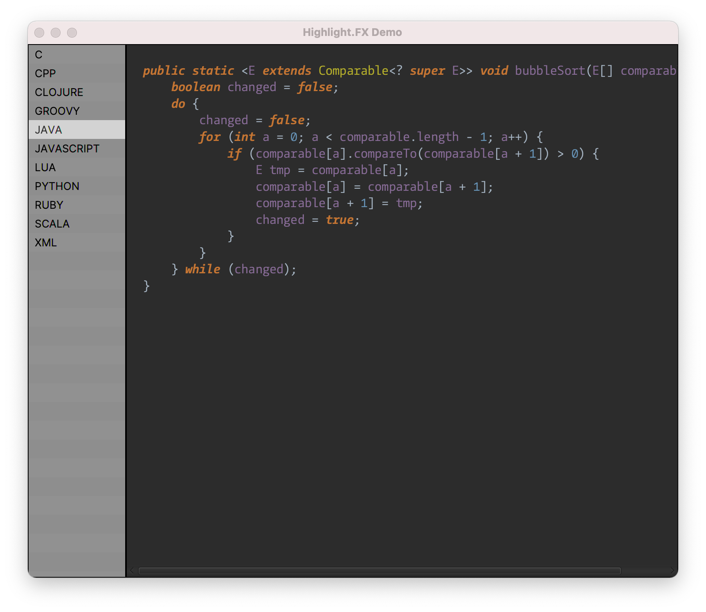

# highlight.fx 

Currently includes only `SyntaxPane`, lightweight syntax highlighting control. 

See the [`demo application`](https://github.com/eugener/highlight.fx/blob/45f8998ebfcb9ccea3919933f0a961c7b60e4781/demo/src/main/java/io/github/eugener/highlightfx/demo/Main.java#L37) for an example of the SyntaxPane usage. 

